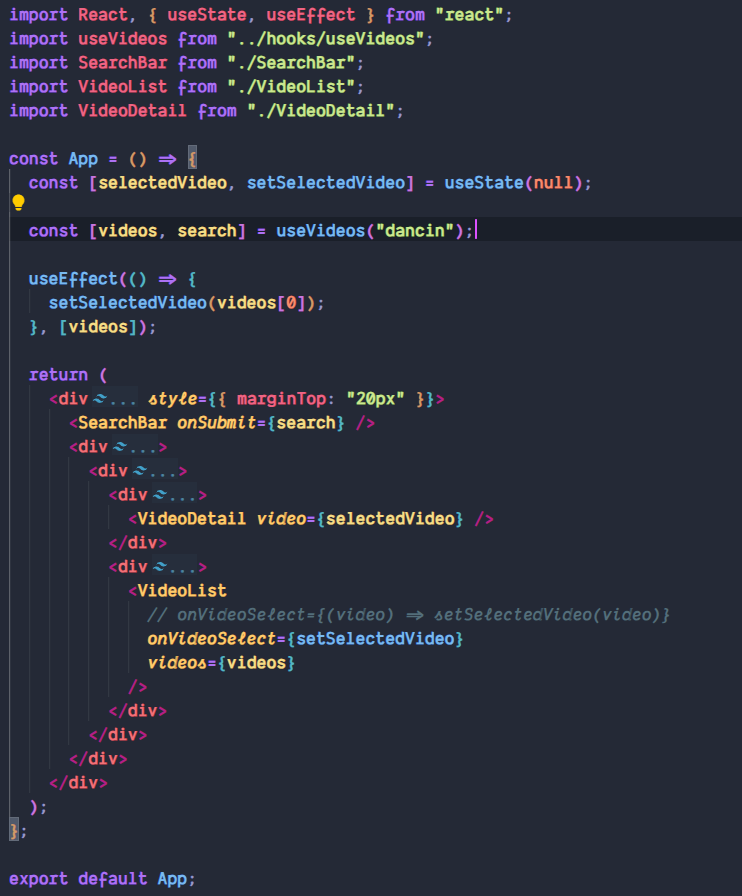
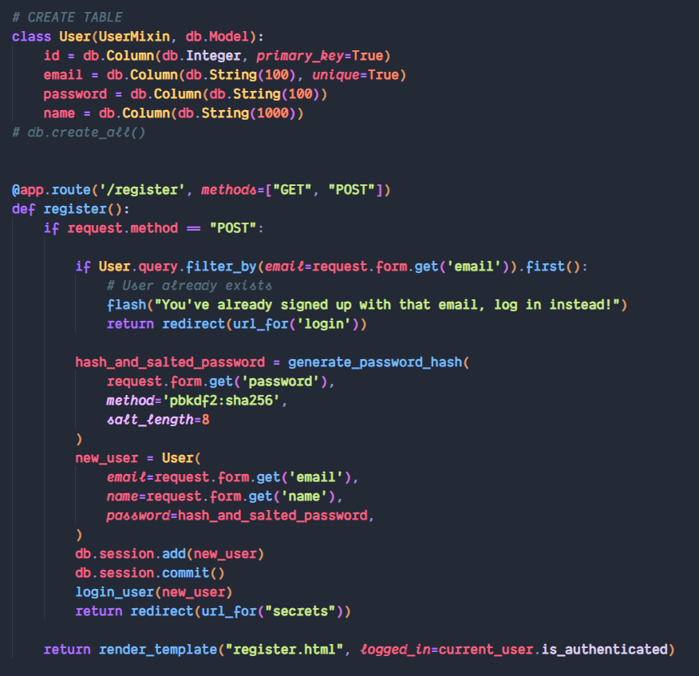
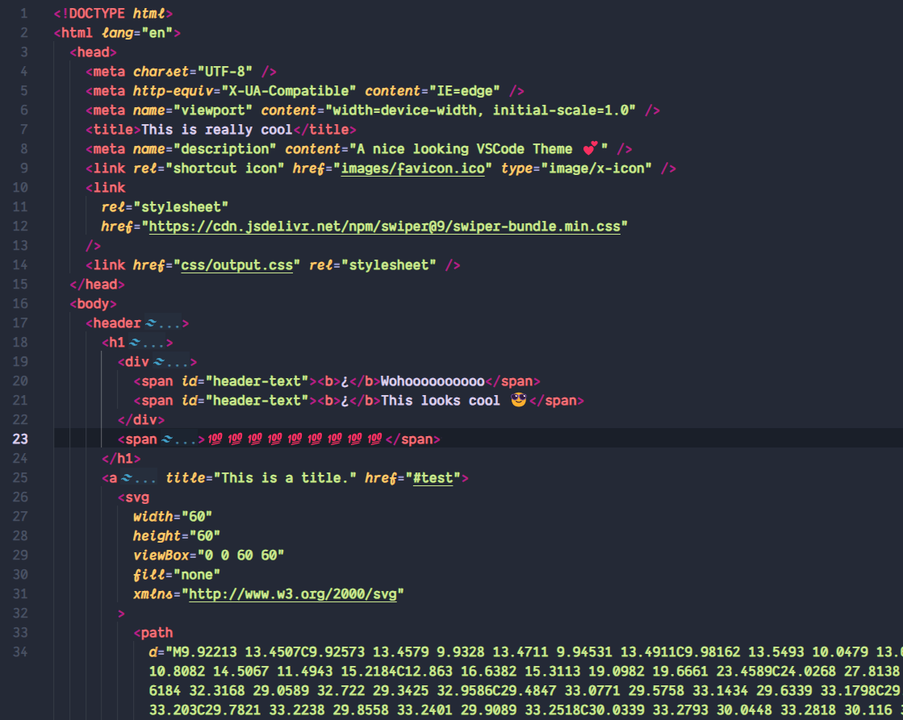

# Nachanga Theme - Visual Studio Code Extension

**Nachanga Theme** is a carefully crafted Visual Studio Code theme that aims to provide an immersive, visually pleasing, and productive coding experience. We've taken the best elements from various popular themes and added our unique touch to create a theme that's both comfortable for the eyes and aesthetically appealing.

## Why Nachanga Theme?

- **Beautiful & Balanced**: Nachanga Theme strikes a perfect balance between light and dark themes. It offers a clean and sleek interface that's easy on the eyes and reduces visual fatigue during long coding sessions.

- **Enhanced Readability**: Our theme enhances code readability by using a thoughtfully chosen color palette. You'll find your code easier to understand and navigate.

- **Versatile**: Whether you're a front-end developer, a back-end coder, or a data scientist, Nachanga Theme adapts to your coding needs. It provides syntax highlighting that's consistent across various programming languages.

- **Fast and Lightweight**: Nachanga Theme is designed with performance in mind. It won't slow down your Visual Studio Code, ensuring a smooth and snappy experience.

## Installation

1. Open Visual Studio Code.
2. Go to the Extensions view by clicking on the square icon on the sidebar or by pressing `Ctrl+Shift+X`.
3. Search for "Nachanga Theme".
4. Click the Install button to install it.
5. Reload Visual Studio Code for the changes to take effect.

## Customization

We understand that everyone has their own coding style and preferences. Nachanga Theme is highly customizable. To make adjustments, follow these steps:

1. Open the Command Palette by pressing `Ctrl+Shift+P`.
2. Type "Color Theme" and select "Preferences: Color Theme" from the dropdown.
3. Choose "Nachanga Theme" from the list.
4. You can further customize it by clicking on the gear icon in the top-right corner of the window and selecting "Color Theme" from there.

## Feedback and Contributions

We're committed to improving Nachanga Theme to meet your coding needs. If you have suggestions, find bugs, or just want to chat, feel free to [open an issue](https://github.com/Nachop51/nachop-theme/issues) on our GitHub repository.

If you're a theme enthusiast or developer, we'd love to have your contributions! Fork the [GitHub repository](https://github.com/Nachop51/nachop-theme), make your changes, and submit a pull request.

## Showcase

Here are a few screenshots showcasing Nachanga Theme in action:

- JavaScript
  

- Python
  

- HTML
  

## License

Nachanga Theme is licensed under the [MIT License](LICENSE).

---

Give Nachanga Theme a try, and experience a whole new level of coding in Visual Studio Code. We hope it enhances your productivity and makes your coding journey even more enjoyable. Happy coding!

If you find Nachanga Theme helpful, don't forget to star the [GitHub repository](https://github.com/Nachop51/nachop-theme) and share it with your fellow developers.

Thank you for choosing Nachanga Theme! 🚀
